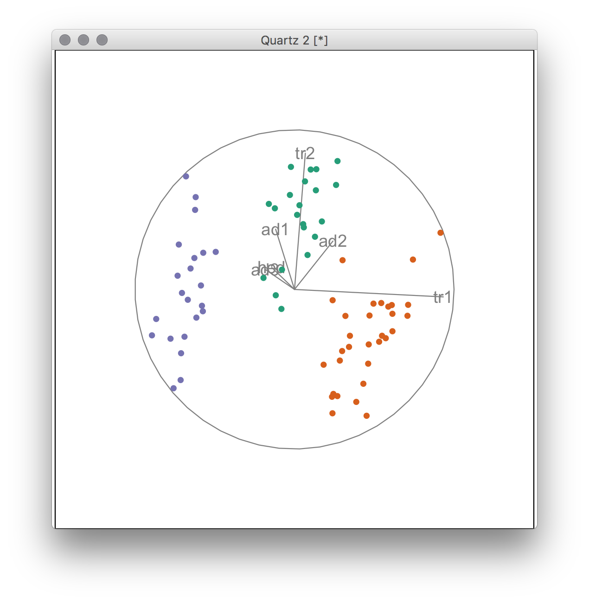

```{r setup, include=FALSE}
knitr::opts_chunk$set(echo = FALSE, 
                      message=FALSE, 
                      warning=FALSE,
                      error=FALSE,
                      cache=TRUE)
# Load any R packages you need here
```


# Motivation {-}

Particle physics involves multivariate model specification. Different theorists propose different explanatory models, and it is important to provide tools to compare the models. For the most part, this is done by plotting pairs of variables. However, the differences between models may involve more than two variables. The goal of this research is to provide a new tool to help explore differences between multivariate data using linear combinations of more than two variables.

```{r fleascatmat, fig.width=7, fig.height=7, fig.align='center',  fig.cap="All pairs of variables for showing differences between three groups."}
library(tidyverse)
library(GGally)
ggscatmat(flea, columns=2:7, color="species") + scale_colour_brewer(palette="Dark2")
```

```{r eval=FALSE, echo=FALSE}
library(tourr)
library(RColorBrewer)
pal <- brewer.pal(3, "Dark2")
col <- pal[as.numeric(flea$species)]
animate_xy(flea[,-1], tour_path=guided_tour(lda_pp(flea$species)), col=col)
```

```{r fleatour, out.width="70%", fig.align='center', fig.cap="Linear combination of all variables revealing a bigger difference between groups than can be seen in pairs of variables alone."}

```
