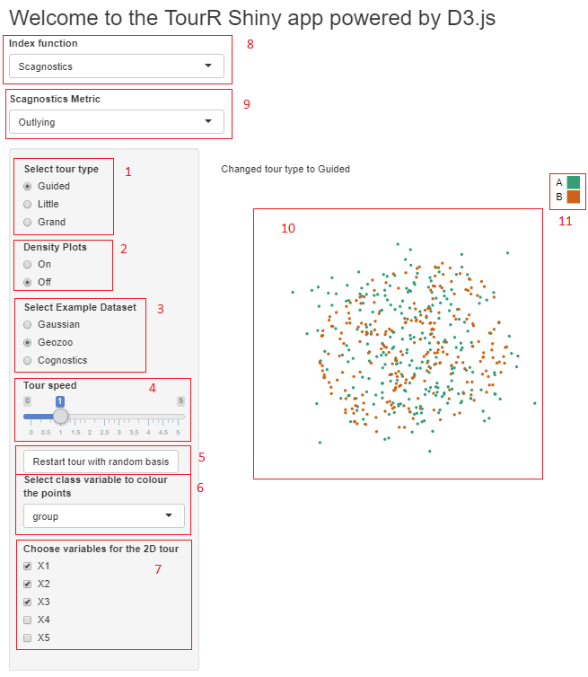

```{r setup2, out.width="85%", include=FALSE}
knitr::opts_chunk$set(echo = FALSE, 
                      message=FALSE, 
                      warning=FALSE,
                      error=FALSE,
                      cache=TRUE)
# Load any R packages you need here
```

# Tour GUI {#ch:tourgui}

The new GUI for the tour was developed using the programming languages R and JavaScript, leveraging Shiny for the user interface and D3 for visualising the data. The tour paths are calculated using R with the `tourr` package, which are then sent to D3 via the Shiny webserver, which also handles and renders the UI widgets.

The new user interface allows the user to control the tour type, speed, density display toggles and projection index for the guided tour. It currently allows selection between a number of example datasets and in future will allow direct selection and upload of a new dataset using Shiny's `fileInput()` UI widget.

All of the code for the new UI is included in Appendix A. The most up-to-date version of the code can be found under the title `TourrGuiD3` at Github, at https://github.com/makipp/TourrGuiD3.

An example of the app in action is shown in a short video I recorded and uploaded to YouTube, at https://www.youtube.com/watch?v=cD6qkYQMwFU.

## User interface

```{r guui, fig.align='center', fig.cap="User interface, accessed via Chrome. The UI widgets controlling the display are on the left, with animated scatterplot and legend on the right."}

```

Shown in Figure 3.1 is a screenshot of the current version of the TourrGuiD3 GUI. It features:

1. Tour type selection
2. Density display toggle
3. Selection of example dataset
4. Tour speed ($\omega$)
5. Option to restart tour from a new starting basis -- particularly useful for the guided tours
6. Selection of a class variable used to define the two (or more) groups for discrimination
7. Variable selection
8. Index function selection (only visible with Guided tour selected)
9. Scagnostics metric selection (only visible with Scatnostics index function selected)
10. Animated scatterplot (and density display, if toggled)
11. Colour legend. The scatterplot will be coloured according to the class variable selected in (5).

The User Interface widgets are displayed on the webpage using JavaScript, but are included as Shiny objects when creating the app. The user interface widgets are stored in the shiny app under in the file `ui.R`. For example, the following code snippet is provided as an argument to the `sidebarPanel()` method in Shiny to render the tour type selector (1):

```{r eval=FALSE, echo=TRUE}
radioButtons(
        "type",
        label = "Select tour type",
        choices = c("Guided", "Little", "Grand"),
        selected = "Grand"
      )
```

The other important function served by the `ui.R` file is to define the structure of the webpage itself, including HTML tags which can be referenced by D3 later, for example:

```{r eval=FALSE, echo=TRUE}
mainPanel(
      tags$div(tags$p(" "),
               ggvisOutput("ggvis")),
      tags$div(tags$p(textOutput("type"))),
      tags$script(src = "https://d3js.org/d3.v4.min.js"),
      tags$script(src = "https://d3js.org/d3-contour.v1.min.js"),
      tags$script(src = "https://d3js.org/d3-scale-chromatic.v1.min.js"),
      tags$div(id = "d3_output"),
      tags$div(id = "d3_output_2"),
      tags$div(id = "info"),
      tags$div(id = "info_2"),
      tags$script(src = "d3anim.js"))
  )
```

The `script` tags load the required JS libraries to run D3, while the various `div` tags define areas of the webpage required for Shiny and D3 to define and draw the output. The JS code written as part of the app is located in the `d3anim.js` file, seen in the last script tag loaded.

## Server functions

The back-end of the app is defined in the `server.R` file. It is here which the R functions to manipulate the data and calculate the tour path are shown, as well as input handlers for `input` parameters passed through from the `ui.R` code via the `session` object.

The `observeEvent` Shiny method defines a code block to be run whenever some input value changes. The following code snippet restarts a tour using a random basis:

```{r eval=FALSE, echo=TRUE}
observeEvent(input$restart_random,
              {
                
                p <- length(input$variables)
                b <- matrix(runif(2*p), p, 2)
               
                rv$tour <- new_tour(as.matrix(rv$d[input$variables]),
                                  choose_tour(input$type, input$guidedIndex,
                                  c(rv$class[[1]]), input$scagType), b)
               })
```

the `input` object contains all of the input variables set using the UI widgets in the `ui.R` file. This `observeEvent` environment is run whenever the `input$restart_random` button is clicked. It generates a new random basis from a $N(0,1)$ distribution, and starts a new tour via changing the `rv$tour` variable. Other input variables can be seen in definint the new tour -- the matrix, tour type, and class variables.

Another `observeEvent()` environment (line 57 in the `server.R` code) handles the rest of the UI values, and then a different Shiny environment calculates tour projections and sends them to D3.

## Getting projections

The projections are calculated using the tour object in an `observe()` environment, which repeatedly runs the code until a reactive variable is changed, at which point it is is ``invalidated'' and then re-started. The projections are calculated using the following code block:

```{r eval=FALSE, echo=TRUE}
observe({
    
    tour <- rv$tour
    aps <- rv$aps
    
    step <- tour(aps / fps)
    
    if (!is.null(step)) {
      invalidateLater(1000 / fps)
      
      j <- center(rv$mat %*% step$proj)
      j <- cbind(j, class = rv$class)
      colnames(j) <- NULL
      
      session$sendCustomMessage(type = "data", message = toJSON(j))
    }
    
      else{

      if (length(rv$mat[1, ]) < 3) {
        session$sendCustomMessage(type = "debug", message = 
                                    "Error: Need >2 variables.")
      } else {
        session$sendCustomMessage(type = "debug", message = "Guided tour
                                    finished: no better bases found.")
      }
    }
  })
```

The `step` assignment at the start of the code block requests a new interpolation step from the `tour` path. If it receives a result, it then creates a projection matrix `j`, centers it, adds the class column for colouring, and then sends it to D3 using the `session$sendCustomMessage()` function. 

The if-else logic is used to handle error cases: There will be no projection returned in the case that the guided tour has finished (ie. has optimised the index function), or there are insufficient variables to calculate a path.

## R-D3 interface

There two functions provided by the Shiny framework to transport data between R and javascript: `session$sendCustomMessage()` in R, and the corresponding `Shiny.addCustomMessageHandler()` in Javascript. Whenever the former is executed in R, the latter function will execute a code block in JS. There are many examples of such functions being used to pass arbitrary data from an R app to a JS front-end, few examples exist of this basic functionality to update a D3 animation in real-time.

The data format expected by D3 is in JSON format, which combines two basic programming paradigms: a collection of name/value pairs, and an ordered list of values. R's preferred data formats include data frames, vectors and matrices. Every time a new projection has been calculated with the tour path, the resulting matrix needs to be converted to JSON and sent to D3. The code to send the D3 data looks like this:

```{r eval=FALSE, echo=TRUE}
session$sendCustomMessage(type = "data", message = toJSON(j))
```


This code is from the `observe` environment from the `server.R` file. It converts the projection matrix to JSON format, and sends it to JavaScript with the id `data`. When parsed in D3 by its `data()` method, it is converted back into a logical 2D array where the columns are queried first, then the rows. If column names are included in the JSON, the column indices are strings; otherwise they are integers starting from 1. 

All of the code required to render the scatterplots and legends, along with colours, is JavaScript code in the file `d3anim.js`. In particular, the data from R is handled with the following code:

```js
Shiny.addCustomMessageHandler("data",
    function(message) {
        
        /* D3 scatterplot is drawn and re-drawn using the 
            data sent from the server. */
        
        }

```

Every time the message is sent (25 times per second), the code-block is run. The full code is omitted here for clarity as it is over seventy lines in length, but is included in appendix A and at GitHub.

## Difficulties

In developing the new solution, I needed to solve problems relating to data transport, animation and user interactivity. The basic code snippets above solved the basic problem of the data transport, but how to handle the data, render it properly and expose it to user interactivity were also challenges that needed to be overcome.

### Animation

Drawing static scatterplots in D3 is simple and well-understood in the D3 community. One needs to define an SVG element, then axis and circle elements (the dots on the scatterplot), add them to the SVG element using the `append()` method, and render the SVG element on the page using the `selectAll()` method. 

To update the scatterplot with new values, the circles are removed using the `removeAll()` method and then can be redrawn. If the new values are close enough to the old ones and this redrawing process is done enough times per second, the dots will appear to move across the screen. Alternatively, the `.transition()` method is available, which calculates an interpolation between each step, and the data supplied can be further apart.

The next question to be solved was how to achieve the synchronization of the sending and receipt of the data in such a way that the animation would appear smooth, but remained a faithful reproduction of the tour path as calculated in R. Either the interpolation could be done with the Tour algorithm within R and then sent to JS enough times per second as to make the dots appear animated - for example, 33 times per second, as ultimately chosen or - or the data could be sent less frequently, and animated in D3 using `transition()`.

The tour algorithm interpolates between target planes chosen by the specific tour type along a geodesic tour path. D3's default interpolation is linear, which was not inappropriate for our purpose. It is possible to define a custom interpolation function using D3, using supplementary data about the tour path sent alongside each projection. This has the advantage of reducing the amount of data required to be sent to D3, but the disadvantage of requiring extra logic on the JS side to ensure that the animation is synchronized properly with R.

Ultimately, the geodesic interpolation was done entirely within R and then the draw-redraw method was used within D3 to display the animation. This was because the extra time required to calculate the interpolation caused jerkiness in the animation. The time for each transition can be set in the argument to the `transition()` function in D3, and the number of times per second data is to be calculated using the tour path can be controlled with an argument to the R `tour()` function; but when matching the two arguments together to provide a target number of frames per second, some frames were dropped and pauses were introduced due to the processing time required in Javascript to calculate the transition.

The final result was that the application calculates (in R) thirty-three 2D projections from the data each second using geodesic interpolation along the tour path, transports these to D3, which then removes the previous scatterplot and draws a new one as required. This created an animation with seamless, uniform transitions that was faithful to the tour algorithm.

### Facilitating User Interactivity

The other main challenge was the implementation of the UI design.  In the application's user interface, there are two types of UI element. The first type requires the tour to be discarded and a new one started. An example of this the tour type dropdown. The second type does not require the tour to be restarted; an example of this would be the speed slider, which dynamically alters the angle per second argument to the `tour` function.

In a Shiny app, when a user interacts with a UI widget, its value is recorded in the object `input` as `input$variable`, and is passed to the server object to be used in R code. It is not possible to access such input variables outside of so-called ''reactive'' environments in Shiny. These environments are essentially code blocks that are run whenever a new value is pushed to the server from the UI, and include `reactive()`, `observe()`, `observeEvent()` and a reactive variable object called `reactiveValues`. `observeEvent()` defines a code block that is run whenever a reactive-type variable is changed, for example input variables from UI widgets.

To enable interactivity, the code that starts a new tour, calculates tour paths and sends the data to the web browser for rendering is included in an `observe()` environment together with an `invalidateLater()` method which keeps the code block running in the background. Variables inside an `observe()` environment are considered to be inside the scope of that function and can't be accessed outside of it unless the variables are referring to a `reactiveValues()` object; all input variables which require a new tour to be started are set as part of an `observeEvent()` call which updates a `reactiveValues` vector, including defining a new tour. This restarts the tour with the new parameters and the visualisation continues.

UI widgets of the second type simply send parameters to D3 while the tour is running and don't need to be set as part of a `reactiveValues` vector. When these parameters are changed, a message is sent to D3 using `session$sendCustomMessage` which updates the relavant visualisation parameter and the animation continues.
